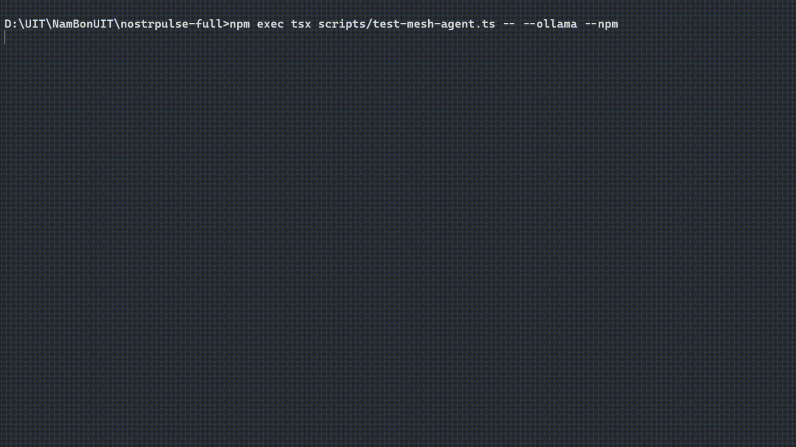

<div align="center">

# ⚡ NostrPulse
### Sovereign Web-of-Trust Graph Engine, Sats-Weighted Anti-Sybil Defense & Full-Cycle Chaumian eCash Protocol Layer
**Autonomous Payments & Sybil-Resistant Trust Matrix for Humans and AI Agents across the Freedom Stack.**

[](https://github.com/PHONGUIT22/nostr-pulse/releases)
[](https://www.npmjs.com/package/nostrpulse-mcp)
[](https://bitshala.org)
[](https://bitshala.org)
[](src/data/ring1-cache.json)
[](src/lib/economic-stake.ts)
[](src/lib/cashu.ts)
[](LICENSE)

<br />

<p align="center">
  
</p>

<p align="center">
  <b>NostrPulse</b> is an open-source analytics explorer, sovereign trust matrix, and full-cycle <b>NIP-61 Chaumian eCash (Cashu)</b> client built on the <b>Freedom Tech Stack</b> (Nostr + Bitcoin Lightning + Cashu eCash + Model Context Protocol). It transforms raw cryptographic keypairs into verifiable, Sybil-resistant reputation metrics while enabling friction-free, offline Value-4-Value micro-settlements for humans and autonomous AI agents.
</p>

<p align="center">
  <a href="https://nostr-pulse.vercel.app/"><b>🚀 Launch Live Explorer »</b></a> •
  <a href="#-walkthrough-demo-video"><b>Demo Video</b></a> •
  <a href="#-happy-path-evaluation-guide-for-judges"><b>Evaluation Guide</b></a> •
  <a href="#-feature-completeness-matrix"><b>Finished vs. Unfinished</b></a> •
  <a href="#-clean-machine-test--setup"><b>Local Setup</b></a> •
  <a href="https://nostr-pulse.vercel.app/agent"><b>AI Agent Hub</b></a> •
  <a href="https://nostr-pulse.vercel.app/bounties"><b>Bounty Board</b></a>
</p>

</div>

---

## 📹 Walkthrough Demo Video

> 📺 **Demo Walkthrough Video (3–5 Minutes):**  
> **[Watch the NostrPulse Walkthrough on YouTube](https://youtu.be/pWb9w-7-gQ8)** *(Placeholder / Direct MP4 available in project releases)*  
> *A concise, high-signal walkthrough demonstrating the working product: 1-click Anti-Sybil inspection, NIP-05 DNS verification, in-app testnet eCash minting, the complete 2-way NIP-61 NutZap receiver inbox proof-swap, and autonomous MCP AI agent payment guardrails.*

---

## 👥 Hackathon Team & Submission Details

| Field | Detail |
| :--- | :--- |
| **Project Name** | **NostrPulse** (`nostr-pulse` / `nostrpulse-mcp`) |
| **Hackathon** | **BOSS Battle Hackathon** (Bitshala — Sep 7 to Oct 5, 2026) |
| **Primary Track** | **Track 2: Freedom Stack** *(Decisive UI/UX & Asynchronous eCash)* |
| **Secondary Track** | **Track 1: Machine Money** *(Autonomous AI Agents, MCP Server, NIP-90 DVM)* |
| **Team / Author** | **Nguyen Hac Phong** ([@PHONGUIT22](https://github.com/PHONGUIT22)) — *Solo Entry*<br>• *Role:* Lead Architect, Protocol Engineer & Full-Stack Developer |
| **Live Production App** | [https://nostrpulse.vercel.app](https://nostrpulse.vercel.app) *(Edge CDN deployed)* |
| **Source Repository** | [https://github.com/PHONGUIT22/nostr-pulse](https://github.com/PHONGUIT22/nostr-pulse) |
| **NPM Package** | [`nostrpulse-mcp` on npm](https://www.npmjs.com/package/nostrpulse-mcp) *(v1.2.0)* |
| **License** | Open-source under the [MIT License](LICENSE) |

---

## 🌐 The Problem, The Approach & Alignment with Rubric

Decentralized open protocols eliminate corporate deplatforming, but introduce two critical structural vulnerabilities for humans and autonomous systems:

### 1. Identity is Computationally Free (The Sybil Flood)
Anyone can spin up 10,000 Nostr keypairs (`npub`) in seconds for zero satoshis. Scammers clone creator bios, scrape avatars, and spam open relays with synthetic identities.
* **Why centralized KYC fails:** Uploading passports or phone numbers destroys cypherpunk privacy and creates honeypots.
* **Why naive client-side graph math fails:** Full Web-of-Trust graph traversals (e.g. multi-hop Dijkstra or EigenTrust) sound elegant, but computing multi-hop graphs client-side freezes mobile browsers and crashes tabs.

### 2. Lightning Tipping is Synchronous and Fragile
Standard Lightning Zaps (NIP-57) require real-time peer coordination. If a creator's phone goes to sleep, their node loses power, or routing channels lack inbound liquidity, payments fail immediately. Fans want to tip 100 sats; instead, they hit routing timeouts.

### 3. Software Agents Have No Banking Rails (Machine Money)
Autonomous AI agents (Claude Desktop, Cursor, LangChain) have no legal identity, credit cards, or bank accounts. When given financial autonomy, agents face catastrophic runaway loop spend, hallucinated invoices, or prompt injection attacks without verifiable reputation and hard spending guardrails.

---

### How NostrPulse Solves It (The Freedom Tech Paradigm)

```text
+-----------------------------------------------------------------------------------+
|                           NOSTRPULSE ARCHITECTURE                                  |
+-----------------------------------------------------------------------------------+
|  1. SOVEREIGN REPUTATION & ANTI-SYBIL LAYER (Freedom Stack & Radar)               |
|     - 4-Tier Web-of-Trust Graph: Hop 0 (21 Root Anchors), Hop 1 (Ring-1),         |
|       Hop 2 (Transitive Trust), Hop 3 (Isolated / Sybil Risk)                     |
|     - High-Performance Ring-1 Snapshot: 5,544 nodes pre-computed in RAM (< 3ms)   |
|     - Sats-Weighted In-Degree (Pillar 2): Logarithmic economic stake with         |
|       strict self-zap wash trading rejection and Sybil clone filtering            |
|     - NIP-05 DNS Anchor: Cryptographic HTTPS .well-known DNS identity mapping     |
|     - Strict Anti-Sybil Gatekeeper: Clamps isolated keys at <= 25 pts             |
+-----------------------------------------------------------------------------------+
|  2. ASYNCHRONOUS VALUE SETTLEMENT LAYER (Dual-Rail Micro-Payments)                |
|     - Synchronous Rail: NIP-57 Lightning Zaps with WebLN auto-dispatch            |
|     - Asynchronous Rail: NIP-61 Cashu NutZaps (Kind 9321 bearer eCash delivery)   |
|     - NIP-44 v2 E2E Encryption: Front-running and MEV-immune bearer token payload |
|     - Native RFC 8949 Binary CBOR Decoder: Sub-millisecond parsing, zero-npm deps |
|     - Keyset ID Auto-Expansion: Resolves 16-hex vs 66-hex Cashu V4 mismatch       |
+-----------------------------------------------------------------------------------+
|  3. MACHINE MONEY & AUTONOMOUS AGENT LAYER (Model Context Protocol)               |
|     - Model Context Protocol (MCP) Server: Stdio JSON-RPC tools for AI agents     |
|     - Autonomous Spending Guardrails: Rolling 24h budget limits & per-tx caps     |
|     - WoT-Gated Payment Gate: Rejects agent payments to counterparties < 40 score |
|     - NIP-47 Nostr Wallet Connect (NWC): Automated node Lightning execution       |
|     - NIP-90 Open Work / DVM Marketplace: Decentralized task compute & bounty     |
+-----------------------------------------------------------------------------------+
|  4. INTEROPERABILITY & OPEN ADOPTION                                              |
|     - Standalone Embeddable Widget: Zero-dependency Vanilla JS (<nutzap-me>)      |
|     - Public Open REST API: CORS-enabled /api/v1/trust-score/[pubkey]             |
+-----------------------------------------------------------------------------------+
```

---

## 📊 Feature Completeness Matrix

In accordance with Bitshala Hackathon Slide 13 guidelines, we practice **radical transparency** regarding what is fully finished and verified versus what is scoped for future iterations:

### ✅ Shipped & Finished (100% Implemented & Verified)

| Component / Subsystem | Status | Technical Implementation & Verification Details |
| :--- | :---: | :--- |
| **Web-of-Trust Ring-1 Graph Engine** | **Finished** | 5,544 nodes pre-computed in [`src/data/ring1-cache.json`](src/data/ring1-cache.json), $O(1)$ memory lookup ($< 3\text{ms}$), 21 curated Root Anchors across 4 tiers. |
| **Sats-Weighted In-Degree Stake** | **Finished** | Sub-linear logarithmic economic stake ($\log_{10}(\text{sats}+1) \times 2.5$) with strict self-zap wash trading rejection and Sybil sender filtering. |
| **Multi-Hop Transitive Trust Resolver** | **Finished** | 4-Tier social distance classification (Hop 0–3) with bounded relay timeouts ($\le 3000\text{ms}$) via `Promise.race`. |
| **Strict Anti-Sybil Gatekeeper** | **Finished** | Hard mathematical ceiling: $\le 25\text{ pts}$ for isolated keys without WoT stake, $\le 35\text{ pts}$ for Hop 3+ with stake, $\le 50\text{ pts}$ for Hop 2. |
| **Zero-Dependency RFC 8949 CBOR Decoder** | **Finished** | Handcrafted parser in [`src/lib/cashu.ts`](src/lib/cashu.ts) supporting Major types 0–7 and 64-bit integers with zero npm buffer dependencies. |
| **Full-Cycle NIP-61 NutZap Sender** | **Finished** | In-app 1-click testnet minting, NIP-44 v2 encryption, and concurrent Kind 9321 multi-relay broadcasting. |
| **NIP-61 NutZap Receiver Inbox** | **Finished** | Open-relay ingestion for Kind 9321 events, client-side NIP-44 decryption, and live event refresh. |
| **Truncated Keyset ID Auto-Expansion** | **Finished** | Resolves the 16-hex vs 66-hex Cashu V4 mismatch via `/v1/keysets` prefix matching in `claimNutZapToken()`. |
| **Fail-Closed NUT-07 Double-Spend Shield** | **Finished** | Real-time proof-state verification against the mint; converts spent tokens into educational badges without breaking UI state. |
| **Standalone Embeddable NutZap Widget** | **Finished** | Zero-dependency script and Web Component in [`public/widget.js`](public/widget.js) with Lightning mint quote and proof swap. |
| **Public Open Trust Score REST API** | **Finished** | CORS-enabled public endpoint at `/api/v1/trust-score/[pubkey]` delivering structured WoT graph and economic stake metrics. |
| **Model Context Protocol (MCP) Server** | **Finished** | Published npm package (`nostrpulse-mcp` v1.2.0) exposing 10 Stdio JSON-RPC tools for Claude Desktop, Cursor, and Windsurf. |
| **NIP-47 Nostr Wallet Connect (NWC)** | **Finished** | Autonomous Lightning settlement via Kind 23194/23195 with zero memory-leak lifecycle management. |
| **WoT-Gated Dynamic Mint Mesh (NUT-06)** | **Finished** | Autonomous Cashu mint health auditor and dynamic router via `auditCashuMint` and `selectBestMint`. |
| **Autonomous Spending Guardrails** | **Finished** | Rolling 24h budget limits (500 sats), per-tx caps (50 sats), and WoT trust-score gatekeeping (< 40 score blocked). |
| **Zero-Config Agent Identity Bootstrapping** | **Finished** | Automatic local `secp256k1` keypair generation (`.nostrpulse/agent-identity.json`) with restricted permissions (0600). |
| **NIP-90 Open Work & DVM Marketplace** | **Finished** | Task bounty board at `/bounties` with Kind 5000 request publishing, feedback streams, and eCash payout settlement. |
| **Dual Network Engine (Fast vs Pure P2P)** | **Finished** | Global navbar toggle switching between Primal Edge cache and 100% direct WebSocket connections via `SimplePool`. |
| **Head-to-Head Compare Arena** | **Finished** | Side-by-side identity and trust matrix comparison at `/compare`. |
| **Relay Telemetry Monitor** | **Finished** | Live latency and WebSocket connection health dashboard across decentralized relays at `/relays`. |

---

### ⚠️ Known Limitations & Scoped for Next (Honest Engineering Scoping)

| Limitation / Scoped Feature | Current Behavior | Planned Solution (Post-Hackathon) |
| :--- | :--- | :--- |
| **NUT-11 P2PK Proof Locks** | Proofs are transmitted as encrypted bearer secrets via NIP-44 v2. | Enforce mint-level Pay-to-Public-Key locks once widely deployed on mainnet mint nodes. |
| **Decentralized Relay Jitter** | Public relays occasionally time out when publishing Kind 9321 events. | Mitigated via concurrent multi-relay broadcast (5+ indexing relays) with local cache reconciliation. |
| **Testnet Mint Availability** | Live demo defaults to public `https://testnut.cashu.space`. | Provide in-app automated failover to secondary mints (Minibits, Macadamia) upon connection drop. |
| **Automated Auto-Melt Service** | Creators manually claim eCash into fresh proofs. | Build threshold-based background daemon auto-melting accumulated eCash tokens into native Lightning node balance. |

---

## ⚡ Clean-Machine Test & Setup

nostr-pulse is engineered with **zero mandatory external environment variables, zero required API keys, and zero database setup** out of the box. A judge can clone and run it in **under 5 minutes**:

### Prerequisites
* **Node.js:** `>= 18.18.0` (v20+ recommended)
* **Package Manager:** `npm`, `pnpm`, or `yarn`
* **Browser:** Modern Chromium, Firefox, or Safari browser (with or without Nostr extensions like Alby/nos2x)

### 1. Clone & Install Dependencies
```bash
git clone https://github.com/PHONGUIT22/nostr-pulse.git
cd nostr-pulse
npm install
```

### 2. Start the Local Development Server
```bash
npm run dev
```
Open **[http://localhost:3000](http://localhost:3000)** to explore the full dashboard.

### 3. Verify Production Build & TypeScript Integrity
```bash
# Verify 0 TypeScript errors
npx tsc --noEmit

# Verify Next.js Turbopack production compilation (all 21 static/dynamic routes)
npm run build
```

---

## 🧪 Happy Path Evaluation Guide for Judges

You can evaluate the complete system without installing browser extensions or spending real money:

### Step 1: 1-Click Anti-Sybil Matrix Inspection (Freedom Stack)
1. Navigate to the **[Live App Homepage](https://nostrpulse.vercel.app/)**.
2. Immediately below the search bar, locate the **Live Interactive Demo** section.
3. Click **🔥 Inspect Verified Builder** ([fiatjaf](https://nostrpulse.vercel.app/p/npub180cvv07tjdrrgpa0j7j7tmnyl2yr6yr7l8j4s3evf6u64th6gkwsyjh6w6)):
   - Observe the **95 pts** score with the emerald `Verified Builder` tier.
   - Inspect the **Hop 0: Core Root Anchor** cryptographic status (45/45 graph pts), verified NIP-05 DNS signature (`_@fiatjaf.com`), active Lightning endpoint, and network longevity.
4. Click **⚠️ Inspect Sybil Bot Clone** ([anon_bot](https://nostrpulse.vercel.app/p/anon_bot)):
   - Observe how synthetic profile metadata (avatar, bio, external link) accumulated raw points.
   - Notice the **Anti-Sybil Gatekeeper Enforced**: because it has zero graph connectivity (`distance = 3`) and zero incoming WoT sats, its score is **strictly hard-capped at $\le$ 25 pts** (`Unverified / Potential Bot`, `Vulnerable` Sybil resistance), mathematically preventing metadata gaming.

---

### Step 2: Send a NIP-61 NutZap (Sender Pipeline)
1. On any creator profile (e.g., [Jack](https://nostrpulse.vercel.app/p/npub1sg6plzptd64u62a878hep2kev88swjh3tw00gjsfl8f237lmu63q0uf63m)), scroll to the **Support Creator** card.
2. Switch payment tab to **Cashu eCash (NIP-61)**.
3. Obtain a testnet Cashu token via either method:
   - **Method A (In-App 1-Click Mint):** Switch to **1-Click Mint**, select a satoshi amount (e.g. 21 Sats), and settle the testnet invoice.
   - **Method B (Free External Testnet Sats):** Visit [cashu.me](https://cashu.me), set your mint to `https://testnut.cashu.space`, claim free testnet sats, and copy the `cashuB...` or `cashuA...` token.
4. Paste the token into the input box and click **Verify eCash Token**:
   - Watch our zero-dependency RFC 8949 binary CBOR decoder unpack the proofs and verify spend-state directly against the mint (`https://testnut.cashu.space`).
5. Click **Send Sats (NutZap)**:
   - The token is sealed via **NIP-44 v2 ChaCha20-Poly1305 authenticated encryption** using a Diffie-Hellman shared secret derived from the recipient's public key.
   - The encrypted payload is broadcasted concurrently across 5+ public Nostr relays as a **Kind 9321** event.

---

### Step 3: Decrypt & Claim in NutZap Inbox (Receiver Pipeline)
1. Connect with your Nostr extension (Alby, nos2x) using the **Connect** button in the header, or visit your own profile. *(Or click "Inspect with Reviewer Demo Secret" to test without an extension).*
2. Scroll to the **Incoming eCash NutZaps (Kind 9321)** inbox.
3. Observe the relay query fetching incoming Kind 9321 events tagged with `#p: [<your_pubkey>]`.
4. Click **🔓 Decrypt & View Token**:
   - Triggers `window.nostr.nip44.decrypt` to unveil the private memo and bearer token.
5. Click **⚡ Claim to Mint (Swap Proofs)**:
   - **Keyset Auto-Expansion:** Automatically queries mint keysets, expanding truncated 16-hex CBOR keyset IDs to full 66-hex IDs to prevent `MintOperationError: Inputs: 0`.
   - **Atomic Proof Swap:** Executes `wallet.receive()`, instructing the mint to invalidate the sender's secrets and issue fresh, blinded proofs held exclusively by you.
   - **NUT-07 Double-Spend Verification:** The token status updates live to `🟢 Claimed & Swapped`. Attempting to reclaim marks it as `🔴 SPENT`.

---

### Step 4: Standalone NutZap Widget & Public REST API

1. **Test Standalone NutZap Widget (`widget.js`):**
   - NostrPulse ships with a zero-dependency Vanilla JS embed script at `/widget.js`.
   - Any website, blog, or static creator page can embed eCash tipping with a single line:
     ```html
     <script src="https://nostrpulse.vercel.app/widget.js" data-npub="npub180cvv07tjdrrgpa0j7j7tmnyl2yr6yr7l8j4s3evf6u64th6gkwsyjh6w6" data-name="fiatjaf" async></script>
     ```
   - Or use the custom Web Component:
     ```html
     <nutzap-me npub="npub180cvv07tjdrrgpa0j7j7tmnyl2yr6yr7l8j4s3evf6u64th6gkwsyjh6w6" name="fiatjaf" amount="100"></nutzap-me>
     ```
   - Try the interactive live preview inside the **Embed Badge** modal on any profile.

2. **Test Public Open Reputation REST API:**
   - External Nostr clients (Amethyst, Coracle, Snort) can query the CORS-enabled trust endpoint directly for anti-spam filtering:
     ```bash
     curl -s https://nostrpulse.vercel.app/api/v1/trust-score/3bf0c63fcb93463407af97a5e5ee64fa883d107ef9e558472c4eb9aaaefa459d
     ```
   - Returns structured JSON containing `score`, `tier`, `wot.distance`, `wot.endorsers_count`, `economic_stake.total_valid_sats`, and `sybil_resistance_level`.

---

### Step 5: Test Machine Money & MCP Agent Integration

NostrPulse exports a full Stdio Model Context Protocol server. You can test the autonomous machine money layer via automated test scripts or live in Cursor/Claude Desktop:

#### 1. Test All 10 MCP Tools over Stdio JSON-RPC
```bash
npx tsx scripts/test-mcp-stdio.ts
```
*Outputs verification that `check_trust_score`, `pay_cashu_nutzap`, `request_nip90_job`, `pay_lightning_nwc`, `audit_cashu_mint`, and `get_spending_guardrails` execute without errors.*

#### 2. Test Agent Spending Guardrails & Sybil Interception
```bash
npx tsx scripts/test-guardrails.ts
```
*Demonstrates that transactions exceeding 50 sats or targeted at low-trust bot accounts (< 40 score) are short-circuited and blocked before spending any funds.*

#### 3. Connect to Claude Desktop or Cursor IDE
Paste this into your `.cursor/mcp.json` or `claude_desktop_config.json`:
```json
{
  "mcpServers": {
    "nostrpulse": {
      "command": "npx",
      "args": ["-y", "nostrpulse-mcp"]
    }
  }
}
```

---

## 🤖 Core MCP Tools for AI Agents (Machine Money)

| Tool Name | Category | Functionality for Autonomous Agents |
| :--- | :---: | :--- |
| `check_trust_score` | **Radar / Anti-Sybil** | Anti-fraud radar for AI agents. Evaluates Web-of-Trust Ring-1 (21 Root Anchors), transitive hops, and Sybil-filtered Economic Stake before interacting or paying. |
| `pay_cashu_nutzap` | **Payment Rails (eCash)** | Machine-to-machine (M2M) settlement with Chaumian eCash (NIP-61 NutZap) wrapped in NIP-44 encryption with pre-flight spending guardrails. |
| `request_nip90_job` | **Decentralized Compute** | Dispatches compute and data-processing tasks to decentralized NIP-90 Data Vending Machines (DVMs) across Nostr relays with local fallback. |
| `pay_lightning_nwc` | **Payment Rails (Lightning)** | Settle BOLT-11 Lightning invoices through an autonomous node via NIP-47 Nostr Wallet Connect (Alby Hub, Phoenixd, Umbrel). |
| `audit_cashu_mint` | **Mint Radar** | Audit and evaluate counterparty risk of a Cashu eCash Mint using Web-of-Trust graph distance, NIP-05 domain validation, and operator reputation. |
| `route_cashu_mint` | **Mint Mesh** | Dynamically discover and route to the highest-trust, lowest-latency Cashu Mint from the WoT-Gated Dynamic Mint Mesh. |
| `get_agent_identity` | **Zero-Config Identity** | Retrieve active autonomous agent cryptographic identity (`pubkey`, `npub`, source). Automatically bootstraps local keys. |
| `get_spending_guardrails` | **Budget Gatekeeper** | Query current AI agent spending guardrails, daily budget (500 sats rolling), 24h satoshis spent, remaining allowance, and per-tx limits (50 sats). |
| `get_agent_telemetry` | **Telemetry & Audit** | Inspect autonomous agent spending metrics, rolling 24h budget allowance, blocked Sybil threats, and recent telemetry events. |

---

## 📜 Protocol Specifications (NIPs, NUTs & MCP)

| Specification | Layer | Standard Description | Implementation Status |
| :--- | :--- | :--- | :---: |
| **MCP Stdio** | AI Agent | Anthropic Model Context Protocol via Stdio JSON-RPC (`nostrpulse-mcp`) | ✅ Active |
| **NIP-01** | Nostr Core | Event schemas, Schnorr signatures, relay WebSocket subscriptions | ✅ Active |
| **NIP-05** | Identity | DNS-based internet identifier cryptographic mapping (`_@domain.com`) | ✅ Active |
| **NIP-07** | Signer | Browser extension signer interface (`window.nostr`: Alby, nos2x) | ✅ Active |
| **NIP-19** | Entities | Bech32 entity encoding (`npub1`, `nsec1`, `note1`, `nprofile1`) | ✅ Active |
| **NIP-44 v2** | Privacy | Versioned ChaCha20-Poly1305 end-to-end payload encryption | ✅ Active |
| **NIP-47** | Lightning | Nostr Wallet Connect automated Lightning payment execution (`Kind 23194/23195`) | ✅ Active |
| **NIP-57** | Lightning | Synchronous Lightning Zaps (`Kind 9734` Zap Request & `Kind 9735` Zap Receipt) | ✅ Active |
| **NIP-59** | Privacy | Gift Wrap Encryption (Ephemeral key envelope for metadata privacy) | ✅ Active |
| **NIP-60 / NIP-61** | Chaumian eCash | Asynchronous NutZaps via `Kind 9321` encrypted bearer token delivery | ✅ Active |
| **NIP-65** | Routing | Relay List Metadata (`Kind 10002`) for dynamic outbox routing | ✅ Active |
| **NIP-89 / NIP-90** | Compute / DVM | Open Work & Data Vending Machines (`Kind 5000` Request, `Kind 6000` Result) | ✅ Active |
| **NUT-00** | Cashu Tokens | V3 JSON (`cashuA`) and V4 binary CBOR (`cashuB`) specifications | ✅ Active |
| **NUT-02** | Cashu Mint | Keyset ID discovery and status endpoints (`/v1/keysets`) | ✅ Active |
| **NUT-03** | Cashu Swap | Token swapping and proof exchange for recipient ownership | ✅ Active |
| **NUT-04** | Cashu Minting | In-app minting via Lightning BOLT-11 quotes | ✅ Active |
| **NUT-05** | Cashu Melting | Settle BOLT-11 Lightning invoices via Chaumian eCash proofs | ✅ Active |
| **NUT-06** | Mint Info | Mint health & capabilities endpoint (`/v1/info`) | ✅ Active |
| **NUT-07** | Cashu State | Token spend-state verification (`checkProofsStates`) | ✅ Active |

---

## 🔍 Codebase Architecture

```text
nostr-pulse/
├── public/
│   └── widget.js                # Zero-dep standalone embeddable NutZap button
├── src/
│   ├── app/
│   │   ├── page.tsx                 # Homepage with Live Interactive Demo
│   │   ├── p/[npub]/page.tsx        # Profile dashboard, Trust Score breakdown, NutZap Inbox
│   │   ├── bounties/page.tsx        # NIP-90 Open Work & AI DVM Marketplace
│   │   ├── agent/page.tsx           # Autonomous AI Agent Dashboard
│   │   ├── compare/page.tsx         # Head-to-Head Creator Versus arena
│   │   ├── relays/page.tsx          # Real-time WebSocket relay latency monitor
│   │   └── api/
│   │       ├── badge/[npub]/        # Dynamic SVG reputation badge generator
│   │       ├── bounties/            # Server-side NIP-90 open task fetcher
│   │       ├── telemetry/           # Developer audit trail & spending telemetry
│   │       ├── v1/trust-score/      # Public open REST API for external clients
│   │       └── widget/              # Backend quote & claim routes for widget.js
│   ├── components/
│   │   ├── home/
│   │   │   └── HeroSearchSection.tsx# 1-Click Interactive Demo buttons (fiatjaf vs anon_bot)
│   │   ├── detail/
│   │   │   ├── NutZapInbox.tsx      # Kind 9321 inbox, NIP-44 decryption, proof swap
│   │   │   ├── LightningZapCard.tsx # Dual-rail payment card (Lightning + Cashu)
│   │   │   ├── LiveZapFeed.tsx      # Real-time WebSocket streaming Kind 9735 receipts
│   │   │   └── TrustScoreCard.tsx   # 5-Pillar matrix & Anti-Sybil gatekeeper indicator
│   │   ├── bounty/
│   │   │   ├── BountyCard.tsx       # NIP-90 Task card with creator trust badge
│   │   │   └── CreateBountyModal.tsx# Post Kind 5000 job requests with sats bid
│   │   └── layout/
│   │       └── Navbar.tsx           # Global navigation with network mode toggle
│   ├── data/
│   │   └── ring1-cache.json         # 5,544 pre-computed Ring-1 nodes snapshot
│   ├── lib/
│   │   ├── anchors.ts               # 21 curated Root Anchors registry across 4 tiers
│   │   ├── wot.ts                   # Web-of-Trust graph distance resolver
│   │   ├── economic-stake.ts        # Sats-weighted in-degree & wash trading defense
│   │   ├── cashu.ts                 # Zero-dep CBOR decoder, NutZap engine, Keyset resolution
│   │   ├── trust-score.ts           # 5-Pillar scoring matrix & Anti-Sybil Gatekeeper guard
│   │   ├── nip05.ts                 # Cryptographic DNS record verification
│   │   ├── nip90.ts                 # NIP-90 DVM client & subscription manager
│   │   ├── identity-manager.ts      # Zero-config autonomous agent keypair manager
│   │   ├── spending-guardrails.ts   # AI Agent spending limits & policy engine
│   │   ├── mint-mesh.ts             # WoT-Gated Dynamic Mint Mesh & NUT-06 health auditor
│   │   ├── nwc.ts                   # NIP-47 Nostr Wallet Connect client
│   │   ├── telemetry.ts             # Agent telemetry & security event logger
│   │   └── nostr.ts                 # SimplePool relay manager, NIP-19 decoders
│   └── mcp-entry.ts                 # Stdio Model Context Protocol (MCP) server
├── scripts/
│   ├── test-mcp-stdio.ts            # Automated MCP test harness for all 10 tools
│   ├── test-guardrails.ts           # Spending limits & Sybil budget gatekeeper test
│   ├── test-mesh-agent.ts           # Autonomous Agent-to-Agent collaborative mesh test
│   ├── test-nwc-pay.ts              # NIP-47 Lightning payment execution test
│   └── build-ring1-cache.mjs        # Offline multi-relay crawler for Ring-1 snapshot
├── docs/
│   ├── DEVFOLIO_SUBMISSION.md       # Devfolio submission copy (sanitized fields)
│   ├── SYSTEM_BLUEPRINT.md          # Comprehensive architectural blueprint
│   └── ARCHITECTURE_AUDIT.md        # Technical validation & performance audit
└── PRODUCT.md                       # Impeccable durable product register
```

---

## ⚖️ Open Source License & Cypherpunk Statement

Distributed under the **MIT License**. See [LICENSE](LICENSE) for details.

* **Zero Surveillance:** No tracking scripts, no Google Analytics, no session cookies.
* **100% Client-Side Cryptography:** Hashing, CBOR decoding, NIP-44 encryption, and proof swaps occur locally in your browser.
* **Strictly Non-Custodial:** NostrPulse never generates, holds, or requests user private keys (`nsec`), nor does it take custody of user funds. All user signing is mediated via NIP-07 browser extensions.